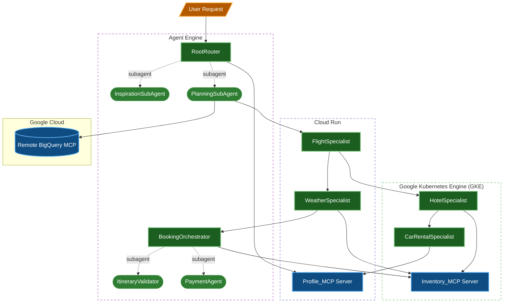
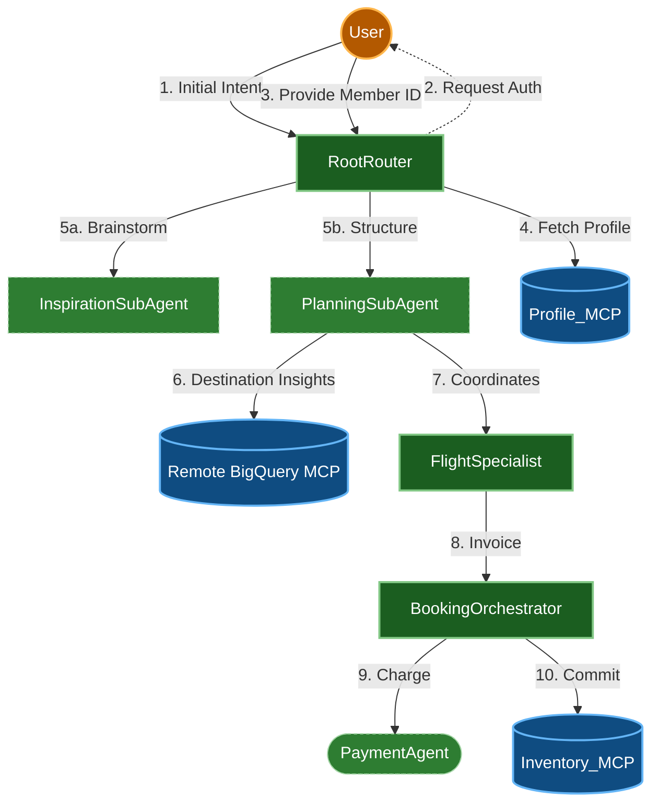
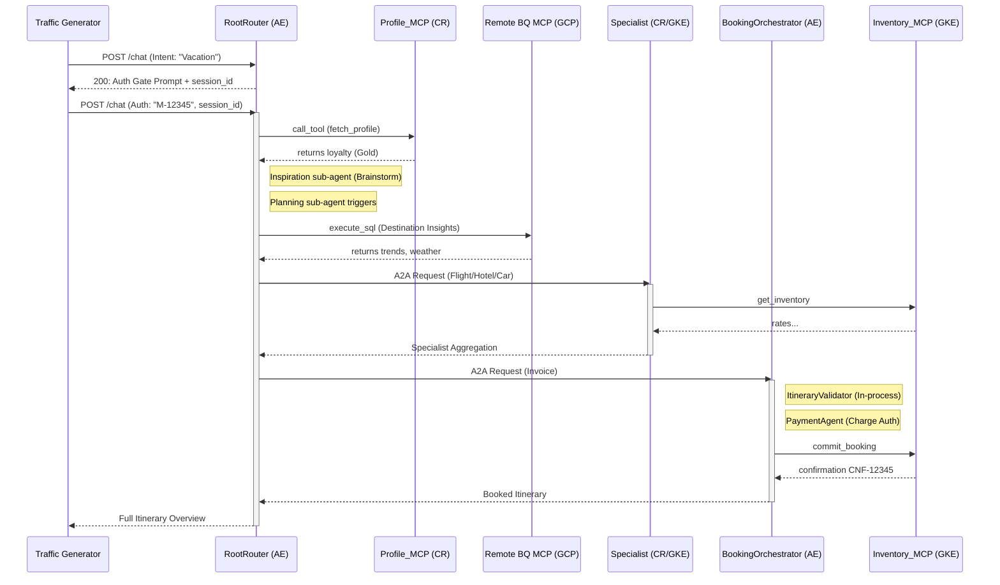

# Enterprise Travel Concierge Testbed

This repository contains a testbed for a distributed AI architecture using the Google Agent Development Kit (ADK), Model Context Protocol (MCP), and OpenTelemetry. The testbed demonstrates cross-environment tracing across Agent Engine, Cloud Run, and Google Kubernetes Engine (GKE) deployments.

## 📚 Documentation Index

For detailed guides answering specific setups, refer to the following manuals:

| Guide | Description |
| :--- | :--- |
| **[Architecture & Design](docs/ARCHITECTURE.md)** | Overall application topology, Specialist call graphs, and mesh protocols. |
| **[Networking & VPC Mesh](docs/NETWORKING.md)** | Details on Load Balancers, Private Service Connect (PSC), and backchannels setups. |
| **[Deployment Guide](docs/DEPLOYMENT.md)** | Multi-phase script automation pipelines and Terraform coordinate bridges. |
| **[Testing & Validation](docs/TESTING.md)** | Procedures running local-all testrunners or remote Reasoning Engine suites. |
| **[Telemetry & Tracing](docs/TELEMETRY.md)** | Framework context hooks governing distributed tracing across mesh edges. |
| **[ADK Instrumentation Guide](docs/ADK_INSTRUMENTATION.md)** | Critical setup differences between Agent Engine vs Cloud Run / GKE runtimes. |
| **[Agent-to-Agent (A2A)](docs/A2A.md)** | Outbound HTTP triggers setups including OIDC transparent auth layers. |
| **[Model Context Protocol (MCP)](docs/MCP.md)** | Generic `_meta` trace propagation hooks crossing multiplexed SSE triggers. |
| **[Developer Expansion Guide](docs/DEVELOPMENT_GUIDE.md)** | Cookbook recipes explaining how to add new agents/tools following compliant patterns. |
| **[Load & Traffic Generator](docs/TRAFFIC_GENERATOR.md)** | Simulating continuous 2-turn conversations triggering full cascades. |

| **[App Hub Setup](docs/APPHUB.md)** | Google Cloud App Hub registration and verification guide. |
| **[Bastion Tunneling](docs/TUNNELING.md)** | Diagnostic mechanics establishing secure IAP tunnels for local endpoints lookup. |


---


## System Architecture

The application is structured into orchestration agents, specialist sub-agents, and resource servers:

- **RootRouter**: The primary orchestration agent deployed on Vertex AI Agent Engine. Enforces an **Authentication Gate** (requiring `member_id`), fetches user profiles via **Profile_MCP**, and delegates to **Inspiration** and **Planning** sub-agents.
- **InspirationSubAgent**: In-process sub-agent managing destination recommendations with nested `PlaceAgent` and `PoiAgent` sub-agents.
- **PlanningSubAgent**: In-process sub-agent managing A2A Specialist triggers for Flight, Hotel, and Car. Queries destination profiling using a fully-managed **Remote BigQuery MCP** (`https://bigquery.googleapis.com/mcp`).
- **BookingOrchestrator**: Transactional agent that validates itineraries (`ItineraryValidator`), processes mock charges (`PaymentAgent`), and commits bookings via `Inventory_MCP`.
- **FlightSpecialist**: Specialist deployed on Cloud Run coordinating flight lookups and seat selections.
- **HotelSpecialist**: Specialist deployed on GKE calculating rates and querying hotel inventory via local MCP.
- **CarRentalSpecialist**: Specialist deployed on GKE adjusting car rates based on loyalty.
- **WeatherSpecialist**: Specialist on Cloud Run providing forecast data.
- **Profile_MCP**: FastMCP SSE server on Cloud Run exposing user travel tiers.
- **Inventory_MCP**: FastMCP SSE server on GKE providing hotel & car levels.

### Shared Utilities

To maintain DRY (Don't Repeat Yourself) principles and architectural consistency, core cross-cutting concerns are managed via `testbed_utils/`:

- **telemetry.py**: Centralized OpenTelemetry initialization, forced GenAI semantic conventions, and multi-client instrumentation.
- **logging.py**: Uniform JSON structured logging for Google Cloud Trace correlation.
- **config.py**: Global environment presets, model version mappings, and shared mock data tables (fare tables, car rates, loyalty discounts) used by local compute tools across agents.

### Hybrid Runtime Distribution

The testbed is configured with a balanced hybrid distribution (2-2-2 for agents, 1-1 for MCPs) to demonstrate cross-runtime orchestration and tracing:

| Runtime | Component | Role | Environment |
| :--- | :--- | :--- | :--- |
| **Agent Engine** | `RootRouter`, `BookingOrchestrator` | Orchestration & Transactions | Managed Reasoning Engine |
| **Cloud Run** | `FlightSpecialist`, `WeatherSpecialist`, `Profile_MCP` | Stateless Reasoning & Identity | Serverless Container |
| **GKE** | `HotelSpecialist`, `CarRentalSpecialist`, `Inventory_MCP` | High-throughput Specialists | Kubernetes Cluster |

### Dependency Diagram



### Data Flow Diagram



## Tool & Interaction Taxonomy

A key design goal of this testbed is to exercise **every type of tool and agent interaction** that can appear in a production system, so that traces contain a representative mix of span patterns. The following table summarizes the interaction types and their tracing characteristics:

| Interaction Type | Network Hop | Span Pattern | Example in Testbed |
| :--- | :--- | :--- | :--- |
| **A2A HTTP delegation** | Yes (HTTP) | HTTP client → HTTP server → `gen_ai.agent` | RootRouter → FlightSpecialist |
| **MCP SSE tool call** | Yes (SSE) | MCP client → SSE transport → `mcp.tool_call.*` | HotelSpecialist → Inventory_MCP |
| **Local Python tool** | No | `gen_ai.tool` (in-process) | FlightSpecialist `validate_dates`, `check_flight_availability`; BookingOrchestrator `calculate_trip_cost`, `format_itinerary`; RootRouter `extract_travel_intent`; HotelSpecialist `calculate_nightly_rate`; CarRentalSpecialist `calculate_rental_price`; WeatherSpecialist `suggest_packing` |
| **In-process sub-agent (transfer)** | No | Parent `gen_ai.agent` → child `gen_ai.agent` | FlightSpecialist → SeatSelector (`sub_agents=[]`) |
| **In-process sub-agent (AgentTool)** | No | Parent `gen_ai.agent` → tool `gen_ai.agent` | RootRouter → IntentClassifier, BookingOrchestrator → ItineraryValidator (`AgentTool`) |
| **ADK built-in tool** | Varies | Platform-specific spans | `google_search` for destination info |

### Local Tools (In-Process)

Not every tool call should cross a network boundary. Local Python function tools produce `gen_ai.tool` spans entirely within the agent's process. These are critical for tracing because they show:
- The contrast between **in-process tool latency** (microseconds) vs **network tool latency** (milliseconds)
- How the LLM's tool-call loop interleaves local and remote operations
- That the OpenTelemetry GenAI instrumentation captures tool inputs/outputs regardless of whether a network hop occurred

Local tools implemented in this testbed (8 total across 6 agents):
- `validate_dates` — date range parsing, duration calculation, boundary validation (FlightSpecialist)
- `check_flight_availability` — route-based fare lookup and duration surcharge calculation (FlightSpecialist)
- `extract_travel_intent` — regex NLP for airport codes, dates, priority, and budget tier (RootRouter)
- `calculate_trip_cost` — multi-component cost aggregation with loyalty discounts (BookingOrchestrator)
- `format_itinerary` — structured itinerary document builder (BookingOrchestrator)
- `calculate_nightly_rate` — destination-based hotel rate multiplier (HotelSpecialist)
- `calculate_rental_price` — car class pricing with loyalty tier discounts (CarRentalSpecialist)
- `suggest_packing` — temperature/condition-based packing list generation (WeatherSpecialist)

### In-Process Sub-Agents

ADK's `sub_agents=[]` parameter allows nesting agents that run in the same process and share the same `InMemoryRunner`. These produce parent-child `gen_ai.agent` spans **without any HTTP call**, which is fundamentally different from A2A delegation. This is important for tracing because:
- It tests that the instrumentation correctly parents spans within a single process
- It shows how agent-to-agent delegation looks when there is no network boundary to propagate `traceparent` across
- It demonstrates the ADK transfer-of-control pattern (where the parent agent yields to a sub-agent and resumes when it completes)

### Why This Matters for Tracing

A testbed that only exercises network-boundary interactions (A2A + MCP) will only validate `traceparent` header propagation. By including local tools and in-process sub-agents, this testbed also validates:
1. **In-process context propagation** — OpenTelemetry's context API within a single service
2. **Span hierarchy correctness** — that child spans are properly parented without relying on HTTP header extraction
3. **Mixed-latency waterfalls** — traces that show both sub-millisecond local operations and multi-second network calls, which is what real production traces look like

## OpenTelemetry Tracing

A core focus of this testbed is robust distributed tracing using OpenTelemetry. All components enforce the latest GenAI semantic conventions (`OTEL_SEMCONV_STABILITY_OPT_IN=gen_ai_latest_experimental`) and propagate W3C `traceparent` headers to trace execution across environments.

- **ADK Agents**: Use `GoogleGenAiSdkInstrumentor` for prompt/response visibility. Outbound HTTP calls (e.g., to sub-agents) inject trace headers via `HTTPXClientInstrumentor`.
- **FastAPI / MCP Services**: Use `FastAPIInstrumentor` to extract incoming trace headers and bind them to the local execution context. Custom spans (e.g., `mcp.tool_call.*`) provide high-fidelity insights into MCP interactions.
- **Local Tools**: Captured by the GenAI instrumentor as `gen_ai.tool` spans. No additional instrumentation is needed — the ADK runner handles span creation automatically.
- **In-Process Sub-Agents**: The ADK runner creates nested `gen_ai.agent` spans for sub-agents, maintaining correct parent-child relationships within the same trace context.

### Traffic Generator

A Cloud Function (`traffic_generator/`) that acts as the root span originator. It is triggered by Cloud Scheduler and sends randomized travel prompts to the RootRouter, exercising the full distributed trace waterfall across all environments.

## Project Structure

```
agent-testbed/
├── agents/
│   ├── RootRouter/           # Primary orchestration agent (Agent Engine, port 8080)
│   │   ├── main.py           # Loader wrapper (Uvicorn / FastAPI Adapter)
│   │   └── root_router/      # Actual ADK Agent package
│   │       ├── agent.py
│   │       ├── prompt.py
│   │       └── sub_agents/
│   ├── BookingOrchestrator/  # Transaction finalizer (Agent Engine, port 8081)
│   │   ├── main.py           # Loader wrapper
│   │   └── booking_orchestrator/
│   ├── FlightSpecialist/     # Flight coordination (Cloud Run, port 8082)
│   │   ├── main.py           # Loader wrapper
│   │   └── flight_specialist/
│   ├── WeatherSpecialist/    # Weather + booking delegation (Cloud Run, port 8083)
│   │   ├── main.py           # Loader wrapper
│   │   └── weather_specialist/
│   ├── HotelSpecialist/      # Hotel inventory + car rental (GKE, port 8084)
│   │   ├── main.py           # Loader wrapper
│   │   └── hotel_specialist/
│   └── CarRentalSpecialist/  # Car rental + loyalty check (GKE, port 8085)
│       ├── main.py           # Loader wrapper
│       └── car_rental_specialist/
├── mcp_servers/
│   ├── Profile_MCP/          # User preferences MCP server (Cloud Run, port 8090)
│   └── Inventory_MCP/        # Hotel/car/weather data MCP server (GKE, port 8091)
├── traffic_generator/        # Cloud Function for trace generation
├── testbed_utils/            # Shared telemetry, logging, and config
├── scripts/                  # Deployment, test, and orchestration scripts
├── terraform/                # Infrastructure-as-Code definitions
└── tests/                    # Unit and integration tests
```

## Prerequisites

- [uv](https://github.com/astral-sh/uv) (for local dependency management)
- Python 3.12+
- Google Cloud SDK (`gcloud`)
- Kubectl (`kubectl`)
- A Google Cloud Project with Billing and the necessary APIs enabled (Vertex AI, Cloud Run, GKE, Cloud Trace).

## Setup & Local Development

This project uses `uv` as the primary build and dependency management tool.

1. **Install Dependencies**:
   ```bash
   uv sync
   ```

2. **Configure Environment Variables**:
   Populate `.env` with your GCP Project ID and regional settings.
   ```bash
   cp .env.example .env
   # Edit .env with your project details
   ```

3. **GKE Cluster Setup**:
   Ensure you have a GKE cluster running (default name: `cluster2`) with Workload Identity enabled. Configure `kubectl` to point to it:
   ```bash
   gcloud container clusters get-credentials cluster2 --region us-central1
   ```

4. **Run Services Locally**:
   Launch all agents and MCP servers concurrently with a single command:
   ```bash
   uv run run-all
   ```

   This starts all services on their designated ports:

   | Service | Port |
   | :--- | :--- |
   | RootRouter | 8080 |
   | BookingOrchestrator | 8081 |
   | FlightSpecialist | 8082 |
   | WeatherSpecialist | 8083 |
   | HotelSpecialist | 8084 |
   | CarRentalSpecialist | 8085 |
   | Profile_MCP | 8090 |
   | Inventory_MCP | 8091 |

   Alternatively, run individual components manually:
   ```bash
   # Run the Flight Specialist
   cd agents/FlightSpecialist
   uvicorn main:app --reload --port 8082

   # Run the Profile FastMCP Server (in another terminal)
   cd mcp_servers/Profile_MCP
   uvicorn main:app --reload --port 8090
   ```

## Testing

This project includes unit and integration tests driven by `uv`.

1. **Local Tests**:
   Ensure you have the full testbed running locally in a separate terminal (`uv run run-all`), then execute the local tests. This runs both unit tests and integration tests against `http://localhost:8080`:
   ```bash
   uv run test-local
   ```

2. **Remote Tests**:
   To test a remotely deployed Root Router, you must provide its endpoint URL via the `ROOT_ROUTER_URL` environment variable:
   ```bash
   ROOT_ROUTER_URL="https://my-router-url.a.run.app/chat" uv run test-remote
   ```

## Cloud Infrastructure (Terraform)

The project uses Terraform to manage cross-provider resources (Cloud Run, GKE, IAM, and Vertex AI Agents).

- **`terraform/`**: Contains the HCL definitions for all services, IAM bindings, and GKE deployments.

To deploy the infrastructure, use the automated deployment script which builds docker images, pushes them to GCR, packages the traffic generator, deploys the Agent Engine components (`deploy-agent-engine`), and runs `terraform apply`:
```bash
uv run deploy
```

> [!NOTE]
> The script automatically uses the `PROJECT_ID`, `CLUSTER_NAME`, and `REGION` (or `GOOGLE_CLOUD_LOCATION`) from your `.env` file. It automatically passes the Docker image URIs for each component and the GCS path for the Traffic Generator source as Terraform variables.

If you prefer to run terraform manually, see the example `terraform.tfvars.example` for the required image reference variables and run `terraform apply` directly in the `terraform/` directory.

### Parallelized Deployment & Logging

The `uv run deploy` command uses a sophisticated orchestration system to minimize deployment time and provide detailed observability:

- **Parallel Execution**: Docker builds, package creation, and Vertex AI Agent Engine deployments are executed concurrently using `ThreadPoolExecutor`.
- **Terraform Optimization**: Terraform is executed with `-parallelism=20` to accelerate the provisioning of cloud resources.
- **Isolated Logging**: Each deployment task redirects its output to a separate log file in `logs/deploy/`. This allows you to monitor specific component builds (e.g., `build_flight-specialist.log`) or infrastructure tasks (e.g., `deploy_agent_engine.log`) without console clutter.

> [!TIP]
> If a specific component fails to build or deploy, check its corresponding log file in the `logs/deploy/` directory for the full stack trace and error message.

## Trace Architecture

The testbed exercises the following OpenTelemetry W3C trace propagation paths across Google Cloud:



## Recommendations & Roadmap

The following enhancements would make this testbed a comprehensive reference implementation for tracing distributed AI agent systems. Items 1 and 2 are implemented; items 3-8 remain as future work.

### 1. Add Local Tools with Real Compute — IMPLEMENTED

Every agent now includes local Python tools that perform real computation (date parsing, fare calculation, cost aggregation, rate adjustment, rental pricing, packing suggestions). These produce `gen_ai.tool` spans entirely in-process, contrasting with network-crossing MCP and A2A spans.

| Agent | Local Tool | Computation |
| :--- | :--- | :--- |
| FlightSpecialist | `validate_dates` | Date range parsing, duration calculation, boundary checks |
| FlightSpecialist | `check_flight_availability` | Route-based fare lookup from `FARE_TABLE`, duration surcharge |
| BookingOrchestrator | `calculate_trip_cost` | Multi-component cost aggregation, loyalty discount application |
| BookingOrchestrator | `format_itinerary` | Structured itinerary document builder with deterministic IDs |
| RootRouter | `extract_travel_intent` | Regex-based NLP: airport code extraction, date detection, priority/budget classification |
| HotelSpecialist | `calculate_nightly_rate` | Destination-based rate multiplier (premium city adjustments) |
| CarRentalSpecialist | `calculate_rental_price` | Car class pricing with loyalty tier discounts from `CAR_RATE_TABLE` |
| WeatherSpecialist | `suggest_packing` | Temperature/condition-based packing list generation |

Shared mock data tables (`FARE_TABLE`, `CAR_RATE_TABLE`, `LOYALTY_DISCOUNTS`) are centralized in `testbed_utils/config.py`.

### 2. Add In-Process Sub-Agents — IMPLEMENTED

Four in-process sub-agents demonstrate both ADK delegation patterns, producing nested `gen_ai.agent` spans without HTTP:

| Parent Agent | Sub-Agent | ADK Pattern | Purpose |
| :--- | :--- | :--- | :--- |
| RootRouter | `InspirationSubAgent` | `AgentTool` | Destination brainstorming and Poi mapping |
| RootRouter | `PlanningSubAgent` | `AgentTool` | A2A coordination and Remote BQ MCP queries |
| BookingOrchestrator | `ItineraryValidator` | `AgentTool` | Validates itinerary completeness |
| BookingOrchestrator | `PaymentAgent` | `AgentTool` | Processes mock payment authorization |

The two patterns produce different span structures:
- **Transfer model** (`sub_agents=[]`): Parent yields control; sub-agent takes over the conversation and transfers back when done
- **Tool model** (`AgentTool`): Parent calls sub-agent as a function; gets result back and continues

### 3. Add Error and Retry Spans

Real traces contain errors. Add deliberate failure modes:
- **Transient failures**: Inventory_MCP randomly returns 503 ~10% of the time, triggering retry spans
- **Validation errors**: `validate_dates` rejects invalid date ranges, producing error spans with `otel.status_code=ERROR`
- **Timeout spans**: Add a slow tool that occasionally exceeds its deadline, showing timeout handling in traces
- **Partial failures**: HotelSpecialist succeeds but CarRentalSpecialist fails, showing how the orchestrator handles mixed results

### 4. Add Parallel Tool Execution

Currently all tool calls are sequential. ADK supports parallel tool calling when the LLM requests multiple tools simultaneously. Add a scenario where this naturally occurs:
- FlightSpecialist checks availability on **multiple airlines** in parallel
- RootRouter fetches profile AND checks flight availability concurrently

This produces **fan-out/fan-in** patterns in traces — multiple child spans running concurrently under one parent — which are critical to validate that the trace viewer renders correctly.

### 5. Add Custom Span Attributes and Events

Enrich spans with domain-specific attributes for better trace filtering and analysis:

```python
from opentelemetry import trace

span = trace.get_current_span()
span.set_attribute("travel.destination", "SFO")
span.set_attribute("travel.user_tier", "Gold")
span.set_attribute("travel.booking_value_usd", 1250.00)
span.add_event("loyalty_discount_applied", {"discount_pct": 15})
```

### 6. Add a Trace Validation Suite

Go beyond integration tests — add tests that inspect the actual trace structure:
- Assert that a complete waterfall produces exactly N spans
- Assert parent-child relationships are correct (e.g., FlightSpecialist span is a child of RootRouter span)
- Assert that `traceparent` trace IDs are consistent across all services
- Assert that local tool spans appear as children of their agent span (not as siblings)
- Assert that error spans have correct `otel.status_code` and `otel.status_description`

### 7. Add Streaming / Multi-Turn Traces

The current testbed is single-turn: one request in, one response out. Real agents often:
- **Stream responses** token-by-token (SSE), producing `gen_ai.content.completion` spans
- **Multi-turn conversations** where the agent asks the user for clarification, producing multiple `gen_ai.chat` spans under one session

Adding a multi-turn scenario (e.g., "the user didn't specify dates, so the agent asks") would exercise session-level tracing.

### 8. Add Metrics and Exemplars

OpenTelemetry isn't just traces. Add metrics that link back to traces via exemplars:
- `gen_ai.client.token.usage` — token counts per agent per request
- `travel.booking.latency` — end-to-end booking duration histogram
- `travel.booking.cost` — booking value distribution
- Link each metric data point to the trace that produced it via exemplars
