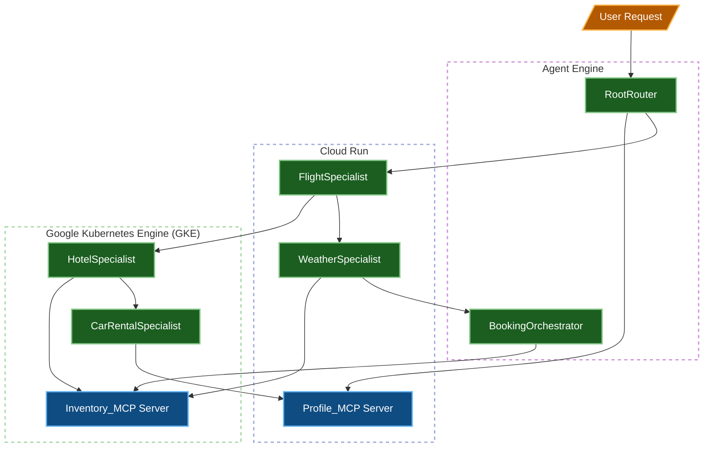
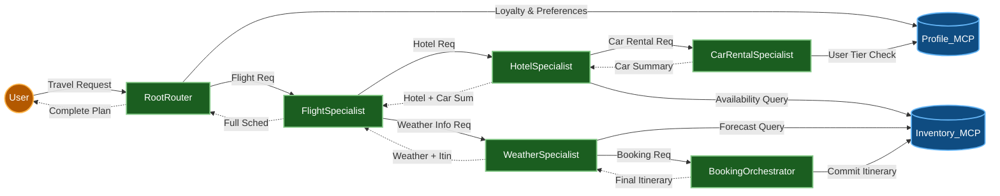
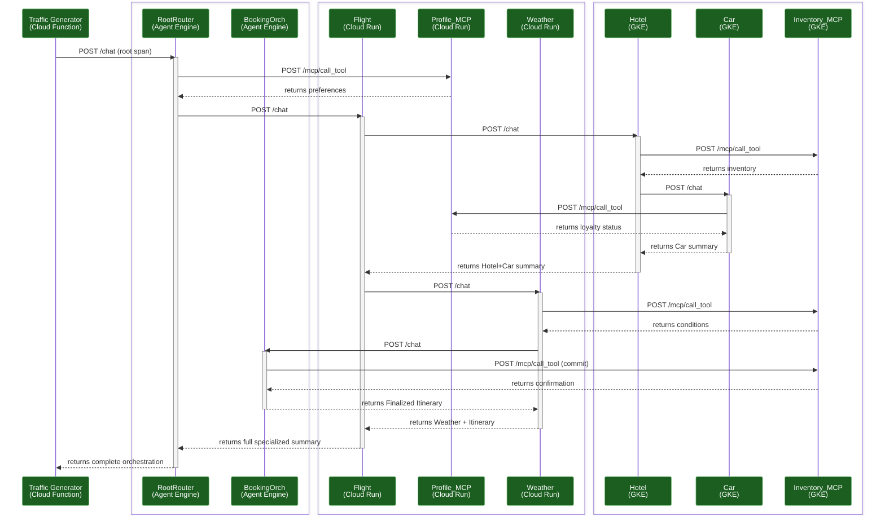

# Enterprise Travel Concierge Testbed

This repository contains a testbed for a distributed AI architecture using the Google Agent Development Kit (ADK), Model Context Protocol (MCP), and OpenTelemetry. The testbed demonstrates cross-environment tracing across Agent Engine, Cloud Run, and Google Kubernetes Engine (GKE) deployments.

## System Architecture

The application is structured into orchestration agents, specialist sub-agents, and resource servers:

- **RootRouter**: The primary orchestration agent deployed on Vertex AI Agent Engine. It handles user requests and delegates to sub-agents.
- **FlightSpecialist**: A specialized agent deployed on Cloud Run, built with FastAPI, that coordinates flight queries.
- **Profile_MCP**: An MCP Server deployed on Cloud Run exposing user travel preferences via HTTP/SSE.
- **Inventory_MCP**: An MCP Server deployed on GKE providing mock hotel and car rental data.
- **BookingOrchestrator**: A transactional agent deployed on Agent Engine that finalizes and commits itineraries.
- **HotelSpecialist**: A specialist agent deployed on GKE that queries hotel inventory and coordinates car rentals.
- **CarRentalSpecialist**: A specialist agent deployed on GKE that checks user loyalty status and proposes rental cars.
- **WeatherSpecialist**: A specialist agent deployed on Cloud Run that checks weather conditions and delegates to the BookingOrchestrator.

### Shared Utilities

To maintain DRY (Don't Repeat Yourself) principles and architectural consistency, core cross-cutting concerns are managed via `testbed_utils/`:

- **telemetry.py**: Centralized OpenTelemetry initialization, forced GenAI semantic conventions, and multi-client instrumentation.
- **logging.py**: Uniform JSON structured logging for Google Cloud Trace correlation.
- **config.py**: Global environment presets and model version mappings to ensure parity across the hybrid topology.

### Hybrid Runtime Distribution

The testbed is configured with a balanced hybrid distribution (2-2-2 for agents, 1-1 for MCPs) to demonstrate cross-runtime orchestration and tracing:

| Runtime | Component | Role | Environment |
| :--- | :--- | :--- | :--- |
| **Agent Engine** | `RootRouter`, `BookingOrchestrator` | Orchestration & Transactions | Managed Reasoning Engine |
| **Cloud Run** | `FlightSpecialist`, `WeatherSpecialist`, `Profile_MCP` | Stateless Reasoning & Identity | Serverless Container |
| **GKE** | `HotelSpecialist`, `CarRentalSpecialist`, `Inventory_MCP` | High-throughput Specialists | Kubernetes Cluster |

### Dependency Diagram



### Data Flow Diagram



## OpenTelemetry Tracing

A core focus of this testbed is robust distributed tracing using OpenTelemetry. All components enforce the latest GenAI semantic conventions (`OTEL_SEMCONV_STABILITY_OPT_IN=gen_ai_latest_experimental`) and propagate W3C `traceparent` headers to trace execution across environments.

- **ADK Agents**: Use `GoogleGenAiSdkInstrumentor` for prompt/response visibility. Outbound HTTP calls (e.g., to sub-agents) inject trace headers via `HTTPXClientInstrumentor`.
- **FastAPI / MCP Services**: Use `FastAPIInstrumentor` to extract incoming trace headers and bind them to the local execution context. Custom spans (e.g., `mcp.tool_call.*`) provide high-fidelity insights into MCP interactions.

### Traffic Generator

A Cloud Function (`traffic_generator/`) that acts as the root span originator. It is triggered by Cloud Scheduler and sends randomized travel prompts to the RootRouter, exercising the full distributed trace waterfall across all environments.

## Project Structure

```
agent-testbed/
├── agents/
│   ├── RootRouter/           # Primary orchestration agent (Agent Engine, port 8080)
│   ├── BookingOrchestrator/  # Transaction finalizer (Agent Engine, port 8081)
│   ├── FlightSpecialist/     # Flight coordination (Cloud Run, port 8082)
│   ├── WeatherSpecialist/    # Weather + booking delegation (Cloud Run, port 8083)
│   ├── HotelSpecialist/      # Hotel inventory + car rental (GKE, port 8084)
│   └── CarRentalSpecialist/  # Car rental + loyalty check (GKE, port 8085)
├── mcp_servers/
│   ├── Profile_MCP/          # User preferences MCP server (Cloud Run, port 8090)
│   └── Inventory_MCP/        # Hotel/car/weather data MCP server (GKE, port 8091)
├── traffic_generator/        # Cloud Function for trace generation
├── testbed_utils/            # Shared telemetry, logging, and config
├── scripts/                  # Deployment, test, and orchestration scripts
├── terraform/                # Infrastructure-as-Code definitions
└── tests/                    # Unit and integration tests
```

## Prerequisites

- [uv](https://github.com/astral-sh/uv) (for local dependency management)
- Python 3.12+
- Google Cloud SDK (`gcloud`)
- Kubectl (`kubectl`)
- A Google Cloud Project with Billing and the necessary APIs enabled (Vertex AI, Cloud Run, GKE, Cloud Trace).

## Setup & Local Development

This project uses `uv` as the primary build and dependency management tool.

1. **Install Dependencies**:
   ```bash
   uv sync
   ```

2. **Configure Environment Variables**:
   Populate `.env` with your GCP Project ID and regional settings.
   ```bash
   cp .env.example .env
   # Edit .env with your project details
   ```

3. **GKE Cluster Setup**:
   Ensure you have a GKE cluster running (default name: `default-cluster`) with Workload Identity enabled. Configure `kubectl` to point to it:
   ```bash
   gcloud container clusters get-credentials default-cluster --region us-central1
   ```

4. **Run Services Locally**:
   Launch all agents and MCP servers concurrently with a single command:
   ```bash
   uv run run-all
   ```

   This starts all services on their designated ports:

   | Service | Port |
   | :--- | :--- |
   | RootRouter | 8080 |
   | BookingOrchestrator | 8081 |
   | FlightSpecialist | 8082 |
   | WeatherSpecialist | 8083 |
   | HotelSpecialist | 8084 |
   | CarRentalSpecialist | 8085 |
   | Profile_MCP | 8090 |
   | Inventory_MCP | 8091 |

   Alternatively, run individual components manually:
   ```bash
   # Run the Flight Specialist
   cd agents/FlightSpecialist
   uvicorn main:app --reload --port 8082

   # Run the Profile FastMCP Server (in another terminal)
   cd mcp_servers/Profile_MCP
   uvicorn main:app --reload --port 8090
   ```

## Testing

This project includes unit and integration tests driven by `uv`.

1. **Local Tests**:
   Ensure you have the full testbed running locally in a separate terminal (`uv run run-all`), then execute the local tests. This runs both unit tests and integration tests against `http://localhost:8080`:
   ```bash
   uv run test-local
   ```

2. **Remote Tests**:
   To test a remotely deployed Root Router, you must provide its endpoint URL via the `ROOT_ROUTER_URL` environment variable:
   ```bash
   ROOT_ROUTER_URL="https://my-router-url.a.run.app/chat" uv run test-remote
   ```

## Cloud Infrastructure (Terraform)

The project uses Terraform to manage cross-provider resources (Cloud Run, GKE, IAM, and Vertex AI Agents).

- **`terraform/`**: Contains the HCL definitions for all services, IAM bindings, and GKE deployments.

To deploy the infrastructure, use the automated deployment script which builds docker images, pushes them to GCR, packages the traffic generator, deploys the Agent Engine components (`deploy-agent-engine`), and runs `terraform apply`:
```bash
uv run deploy
```

> [!NOTE]
> The script automatically uses the `PROJECT_ID`, `CLUSTER_NAME`, and `REGION` (or `GOOGLE_CLOUD_LOCATION`) from your `.env` file. It automatically passes the Docker image URIs for each component and the GCS path for the Traffic Generator source as Terraform variables.

If you prefer to run terraform manually, see the example `terraform.tfvars.example` for the required image reference variables and run `terraform apply` directly in the `terraform/` directory.

### Parallelized Deployment & Logging

The `uv run deploy` command uses a sophisticated orchestration system to minimize deployment time and provide detailed observability:

- **Parallel Execution**: Docker builds, package creation, and Vertex AI Agent Engine deployments are executed concurrently using `ThreadPoolExecutor`.
- **Terraform Optimization**: Terraform is executed with `-parallelism=20` to accelerate the provisioning of cloud resources.
- **Isolated Logging**: Each deployment task redirects its output to a separate log file in `logs/deploy/`. This allows you to monitor specific component builds (e.g., `build_flight-specialist.log`) or infrastructure tasks (e.g., `deploy_agent_engine.log`) without console clutter.

> [!TIP]
> If a specific component fails to build or deploy, check its corresponding log file in the `logs/deploy/` directory for the full stack trace and error message.

## Trace Architecture

The testbed exercises the following OpenTelemetry W3C trace propagation paths across Google Cloud:


