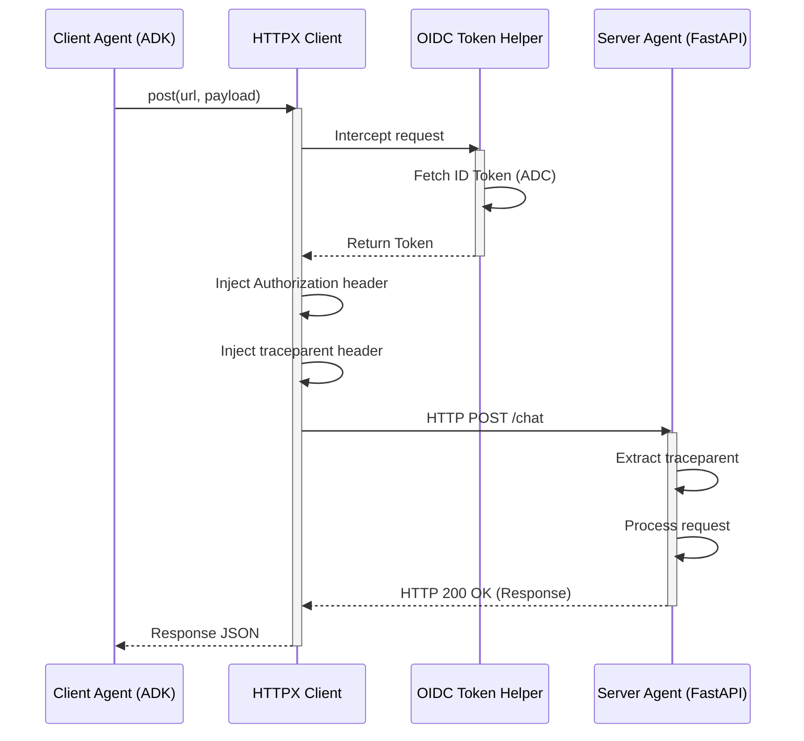

# Agent-to-Agent (A2A) Communication Guide

This document describes how agents communicate with other specialists or endpoints over standard HTTP pathways inside the **agent-testbed**.

---

## 🛰️ 1. Concept: Microservice Delegation

In this mesh, an agent can distribute part of its reasoning process by calling another agent's REST endpoint.
*   **Protocol**: Standard HTTP/JSON `POST` requests.
*   **Edge Design**: Wraps the call inside a Python function tool available to the `LlmAgent`.

## 📊 Sequence Diagram



---

## 💻 2. Implementation Example

Outbound calls use the standard Python `httpx` async client:

```python
import httpx
import os

async def call_flight_specialist(user_id: str, destination: str) -> dict:
    url = os.environ.get("FLIGHT_SPECIALIST_URL", "http://localhost:8082/chat")
    payload = {
        "user_id": user_id,
        "destination": destination
    }
    async with httpx.AsyncClient() as client:
        response = await client.post(url, json=payload, timeout=60.0)
    response.raise_for_status()
    return response.json()
```

---

## 🔍 3. Context Propagation (Tracing)

Distributed tracing is **fully automated** using OpenTelemetry hooks.

1.  **Preparation**: The app entrypoint calls `setup_authenticated_transport()` (from `testbed_utils.telemetry`) at module level during startup.
2.  **Instrumentor**: `HTTPXClientInstrumentor` wraps all `httpx` client instances globally for that process.
3.  **Action**: Outbound requests automatically carry `traceparent` headers without any manual injection code.

---

## 🔒 4. Authorization (OIDC ID Tokens)

Outbound calls targeting **Cloud Run** or secure Gateways require OIDC identity tokens.

*   **Behind the Scenes**: `testbed_utils.telemetry` intercepts outgoing requests to `.run.app` or `.cloudfunctions.net` URLs.
*   **Injection**: Transparently fetches a Google OIDC ID token using Application Default Credentials (ADC) and attaches it as an `Authorization: Bearer <ID_TOKEN>` header.
*   **Validation**: Google-managed infrastructure validates the token before routing the request to the target service.

---

## 📥 5. Inbound Extraction

Every agent receiving an A2A call automatically extracts trace context from inbound requests:
```python
from opentelemetry.instrumentation.fastapi import FastAPIInstrumentor
# Inside app creation:
FastAPIInstrumentor.instrument_app(app)
```
This instruments the FastAPI app to automatically extract `traceparent` headers from incoming requests, linking inbound spans to the distributed trace.
